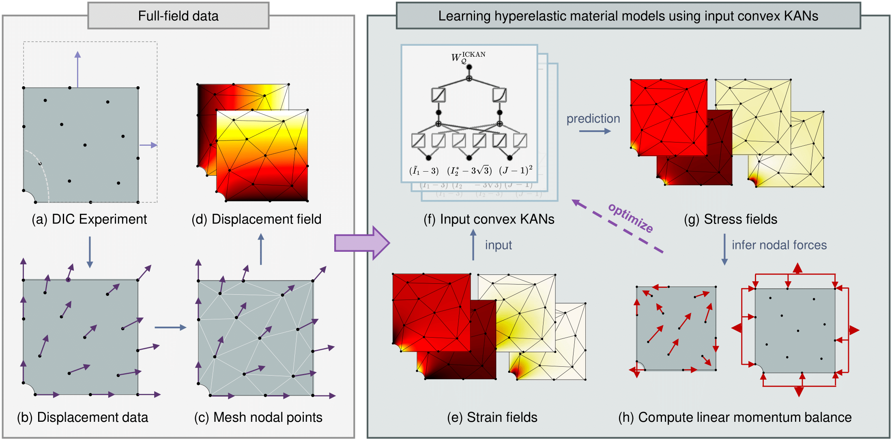

# ICKANs: Input-Convex Kolmogorov-Arnold Networks for Hyperelastic Constitutive Modeling

**Input-Convex Kolmogorov-Arnold Networks (ICKANs)** provide a physics-informed framework for unsupervised learning of polyconvex hyperelastic constitutive laws from full-field strain and force data.

---

## Publication

**Thakolkaran, P., Guo, Y., Saini, S., Peirlinck, M., Alheit, B., & Kumar, S. (2025).**  
*Can KAN CANs? Input-convex Kolmogorov-Arnold Networks (KANs) as hyperelastic constitutive artificial neural networks (CANs).*  
Computer Methods in Applied Mechanics and Engineering: [10.1016/j.cma.2025.118089](https://doi.org/10.1016/j.cma.2025.118089)

---

## Abstract

Traditional constitutive models rely on hand-crafted parametric forms with limited expressivity and generalizability. In contrast, neural network-based models offer greater flexibility but often lack interpretability and physical consistency. To balance these trade-offs, **ICKANs** introduce monotonic input-convex Kolmogorov-Arnold Networks for learning physically admissible, polyconvex constitutive laws.

ICKANs leverage the Kolmogorov-Arnold representation by decomposing complex multivariate functions into compositions of univariate spline-based activation functions, enabling both rich expressivity and interpretability. Through unsupervised training on displacement fields and limited global force measurements, ICKANs robustly capture nonlinear material behavior across a variety of deformation states. The framework also allows for explicit symbolic regression, enabling analytical extraction of learned models. Simulations confirm generalization to unseen geometries and strain states.

---

## Visual Overview

<!-- Placeholder for architecture or workflow image -->


---


## Acknowledgments

This repository makes extensive use of open-source codes that have significantly contributed to the development and implementation of our framework. We gratefully acknowledge the following projects:

- [pykan](https://github.com/KindXiaoming/pykan): We adapt and extend components from the `pykan` repository, which provides a flexible and efficient implementation of Kolmogorov-Arnold Networks (KANs) using spline-based activation functions. This codebase forms the core foundation of our Input-Convex KAN (ICKAN) model architecture.

- [EUCLID-hyperelasticity-NN](https://github.com/EUCLID-code/EUCLID-hyperelasticity-NN): We build upon the NN-EUCLID training and optimization framework, adapting it to support the ICKAN architecture for learning polyconvex constitutive models.


---


## Installation

Clone the repository:

```bash
git clone https://github.com/mmc-group/ICKANs.git
```

Make sure that PyTorch is installed and then install the additional libraries:

```bash
pip install numpy scipy scikit-learn pandas matplotlib pyyaml seaborn sympy setuptools tqdm
```

---

## Datasets

This repository uses DIC-based synthetic datasets from prior work:

- **Materials**: Neo-Hookean, Haines-Wilson, Isihara, Gent-Thomas, Arruda-Boyce, Ogden   
- Dataset source: [EUCLID-hyperelasticity-NN](https://github.com/EUCLID-code/EUCLID-hyperelasticity-NN)

---

## Software Components

| File             | Description |
|------------------|-------------|
| `main.py`        | Entry point for training ICKAN models. Requires command-line arguments: `<fem_material>` and `<noise_level>` |
| `config.py`      | Centralized configuration file (KAN architecture, optimization parameters, plotting settings) |
| `models.py`      | ICKAN implementation with input-convex spline-based neural architecture |
| `train.py`       | Training pipeline with physics-informed loss terms |
| `post_process.py`| Evaluation utilities for model comparison across standard deformation paths, including symbolic regression and plotting |

---

## Example Usage

To train an ICKAN model for the **Arruda-Boyce** material with **high noise** from full-field displacements and global force data:

```bash
cd drivers/
python main.py ArrudaBoyce high
```

This will launch the unsupervised training process using the provided configuration and dataset.

---

For more information, please refer to the [paper](https://doi.org/10.1016/j.cma.2025.118089) or explore the codebase and examples included in the repository.
